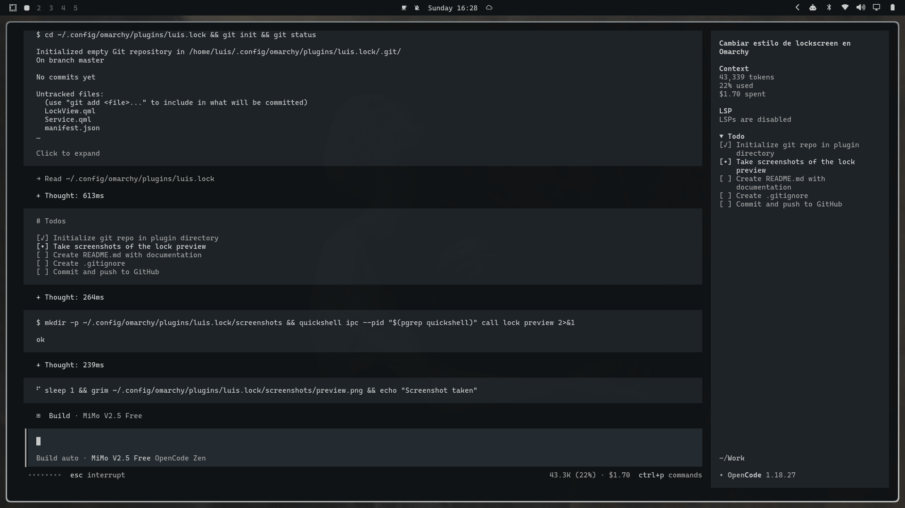
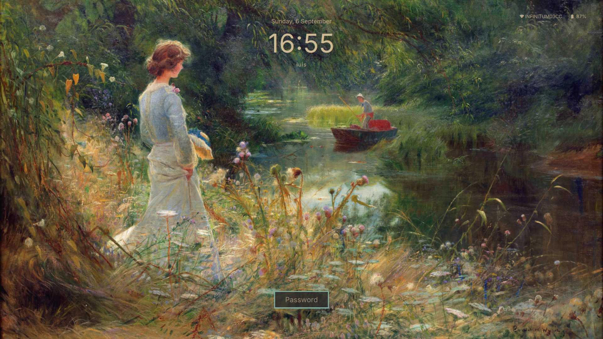

# omarchy-clean-lock

A minimal, clean lock screen plugin for [Omarchy](https://github.com/basecamp/omarchy) with a focus on typography and visual hierarchy.





## Features

- **Inter font** throughout for a modern, clean look
- **Minimalist design** — clock as the hero element at the top
- **Status widgets** — Wi-Fi name and battery level in the top-right corner
- **Password field** — compact, centered at the bottom
- **Fingerprint support** — works with `fprintd` if configured
- **Customizable** — easy to tweak spacing, colors, and layout

## Installation

1. Add the plugin from git:

```bash
omarchy plugin add https://github.com/tokioohh/omarchy-clean-lock --enable
```

2. This creates the plugin at `~/.config/omarchy/plugins/omarchy-clean-lock/`.

3. Edit `~/.config/omarchy/shell.json` to enable the plugin:

```json
{
  "plugins": [
    { "id": "omarchy-clean-lock" }
  ],
  "disabledPlugins": [
    "omarchy.lock"
  ]
}
```

4. Restart the shell:

```bash
pkill quickshell
```

## Structure

```
omarchy-clean-lock/
├── LockView.qml      # UI layout and styling
├── Service.qml       # Lock logic, PAM auth, battery/network status
├── manifest.json     # Plugin metadata
└── screenshots/
    └── preview.png   # Preview screenshot
        preview-2.png # Additional preview screenshot
```

## Customization

### Font

The plugin uses **Inter** by default. To change the font, replace `"Inter"` with your desired font family in `LockView.qml`.

### Colors

Colors are inherited from the active Omarchy theme's `shell.lock.toml`. Edit your theme's lock colors to change:

- `text` — clock, date, status text color
- `background` — password field background
- `borderActive` — input field border when focused
- `borderError` — input field border on auth failure
- `placeholder` — placeholder text color
- `selection` — text selection color
- `textError` — error message color

### Layout

Key properties in `LockView.qml`:

| Property | Default | Description |
|----------|---------|-------------|
| `fieldWidth` | `140` | Password field width |
| `fieldHeight` | `45` | Password field height |
| `topMargin` | `45` | Clock vertical position |
| `topMargin` (widgets) | `34` | Wi-Fi/battery vertical position |

## License

MIT
